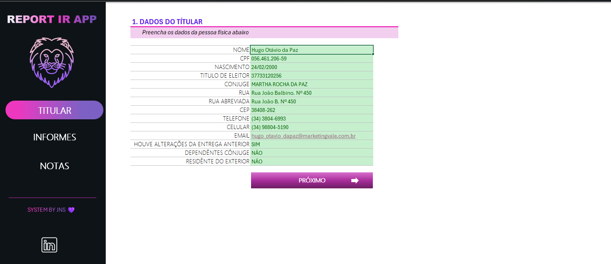
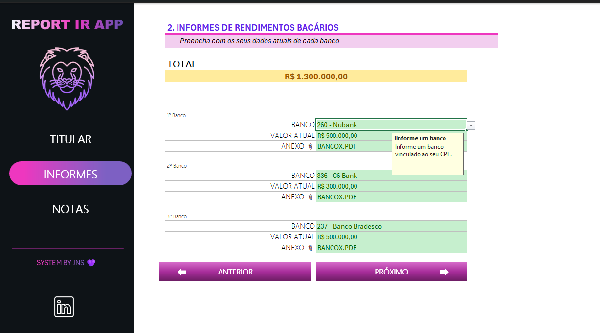
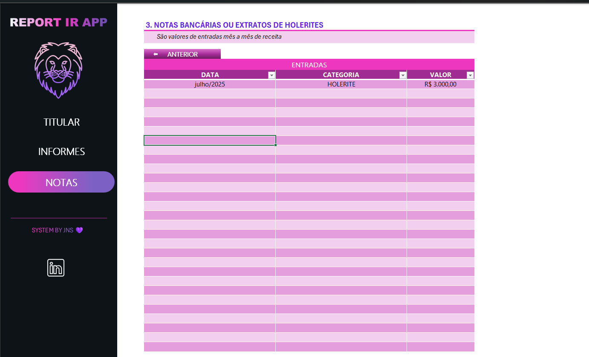

# Desfio criando organizador declaracao imposto renda 🦁
Desafio é criar uma planilha para controle de dados para o irpf.

# Tela Titular

# Tela Informes

# Tela Notas

# Pontos de apredizado:

* Criação de função
* Criação de menus (links) 
* Fórmulas
* Tabelas
* Validação de dados
* Proteção de planilhas

# Agradecimentos

👋 DIO

👋 Felipão